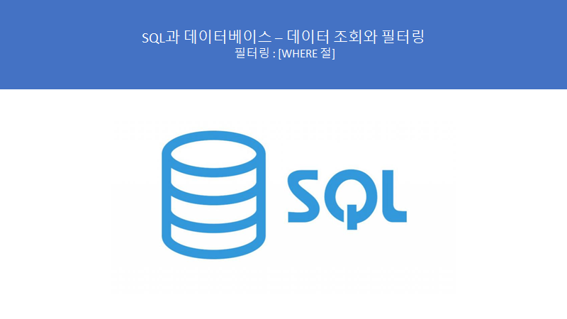
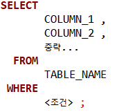
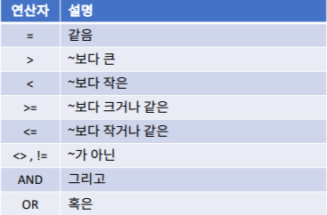
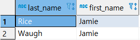
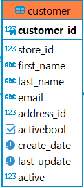
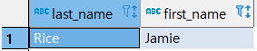
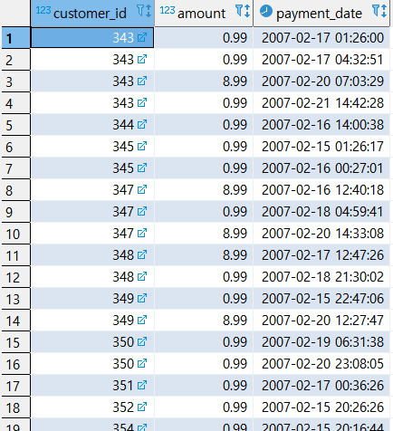
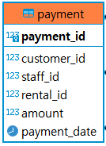

# SQL과 데이터베이스 - 데이터 조회와 필터링 : WHERE 절

> 이 학습은 패스트캠퍼스의 **올인원 패키지 : 모두를 위한 SQL/DB** 강의를 듣고 복습하는 내용입니다.




**## 강의전 TIP!**

**>> SQL은 보기좋게 쓰는 것이 좋다.**

**>> 쓴 다음에 ctrl + shift + F 로 정렬한 다음 바꾸면 편함**

**>> 이전 강의들처럼 쓰지 말고 이번 강의부터 문법들 평행하게, 컬럼이나 조건들 평행하게 쓰는 습관 들이자.**


## WHERE 절 문법

--> WHERE 절은 집합을 가져올 때 어떤 집합을 가져올 것인지에 대한 조건을 설정하는 절이다.



\>> WHERE에 어떤 집합을 가져올지에 대한 조건을 준다.


\- 조건표




## WHERE 절 실습


#### ● 조건 1개


\- 쿼리문

```SQL
SELECT
       LAST_NAME --3
     , FIRST_NAME
  FROM
       CUSTOMER --1
 WHERE
       FIRST_NAME = 'Jamie'; --2
```

\- 실행 결과



\>> FIRST_NAME이 'Jamie' 인 행을 출력하였다.

\>> 실행순서는 FROM, WHERE, SELECT 순으로 보면 된다.

\## customer은 아래와 같이 구성되어 있음



#### ● 조건 2개(AND)


\- 쿼리문

```SQL
SELECT
	  LAST_NAME
	, FIRST_NAME
  FROM
	 CUSTOMER
WHERE
  	 FIRST_NAME = 'Jamie'
 AND LAST_NAME = 'Rice';
```

\- 실행 결과



\>> FIRST_NAME이 'Jamie'이면서, 'LAST_NAME'이 'Rice'인 행을 출력함

#### ● 조건 2개(OR)


\- 쿼리문

```SQL
SELECT
	   CUSTOMER_ID
	 , AMOUNT
	 , PAYMENT_DATE
  FROM
	   PAYMENT
 WHERE AMOUNT <= 1
	OR AMOUNT >= 8
;
```

\- 실행 결과



\>> AMOUNT가 1이하 이거나, 8이상인 행을 출력하였다.

\>> 중략된 결과이고 엄청 많은 행이 출력됨

\## PAYMENT는 아래와 같은 구성되어 있음



