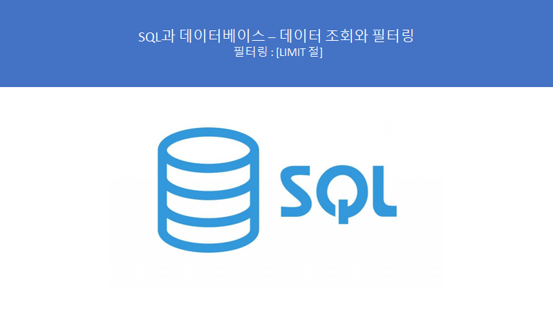
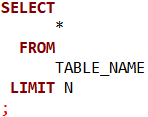
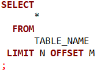
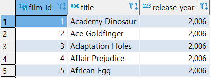
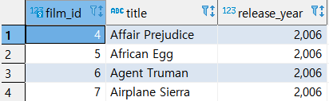
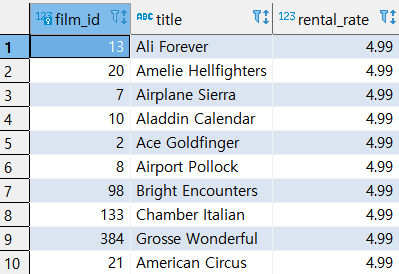
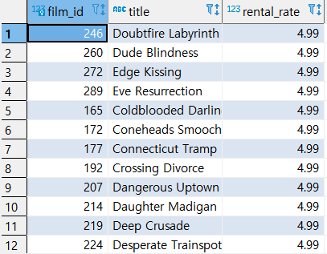

# SQL과 데이터베이스 - 데이터 조회와 필터링 : LIMIT 절

> 이 학습은 패스트캠퍼스의 **올인원 패키지 : 모두를 위한 SQL/DB** 강의를 듣고 복습하는 내용입니다.



**## 정보!**

**- 데이터의 양은 정말 많기 때문에, LIMIT 절은 매우 많이 쓰이는 문법임으로 반드시 숙지해야 함!**

**- 쇼핑몰이나, 어플 등 많은 곳에서 쓰인다.**


## LIMIT 절 문법

--> 특정 집합을 출력 시 출력하는 행의 수를 한정하는 역할을 한다. 부분 범위 처리 시 사용된다. PostgreSQL, MySQL 등에서 지원한다.


#### ● LIMIT



\>> LIMIT으로 출력하는 행의 수를 지정한다.

#### ● LIMIT, OFFSET



\>> LIMIT으로 출력하는 행의 수를 지정하면서 OFFSET으로 시작위치를 지정한다.

​      *OFFSET*  M값의 시작위치는 0이다. (즉 M이 3이라면 0,1,2,3 즉 4번째 행부터 시작하는 것)


## LIMIT 절 실습


#### ● 기본 실습


\- 쿼리문

```SQL
SELECT
	   FILM_ID
	 , TITLE
	 , RELEASE_YEAR
  FROM
	   FILM
ORDER BY FILM_ID --ORDER BY를 한 결과중에서 
   LIMIT 5 ; --5건만 
```

\- 실행 결과



\>> FILM_ID가 오름차순으로 정렬되어 5건만 출력함


#### ● OFFSET의 사용


\- 쿼리문

```SQL
SELECT
       FILM_ID
     , TITLE
     , RELEASE_YEAR
  FROM
       FILM
ORDER BY FILM_ID
   LIMIT 4
  OFFSET 3;
;
```

\- 실행결과



\>> FILM_ID로 오름차순 정렬

\>> 정렬한 값 중에서 결고 건수는 4건으로 제한한다.

\>> FILM_ID로 정렬한 값 중에서 출력행의 시작위치는 3이다.

​     위에서 설명한 것처럼 시작위치 3은 0,1,2,3 즉 4번째 행부터 시작(FILM_ID가 4부터 나왔음)


#### ● 내림차순 정렬


\- 쿼리문

```SQL
SELECT
       FILM_ID
     , TITLE
     , RENTAL_RATE
  FROM
       FILM
ORDER BY RENTAL_RATE DESC
   LIMIT 10
;
```

\- 실행 결과



\>> RENTAL_RATE를 내림차순 으로 정렬

\>> 정렬한 값 중에서 최소 10건 만을 출력


#### ● 내림차순 + OFFSET

```SQL
SELECT
       FILM_ID
     , TITLE
     , RENTAL_RATE
  FROM
       FILM
ORDER BY RENTAL_RATE DESC
   LIMIT 100
  OFFSET 10;
```




\>> RENTAL_RATE 내림차순 정렬

\>> 정렬한 값 중에서 최소 100건 만을 출력

\>> 시작은 10부터! (0,1,2,3,4,5,6,7,8,9,10 다음 11번째 행부터)

​      따라서 위에서 LIMIT 10으로 출력한 값들은 빠져있는 것 확인 가능