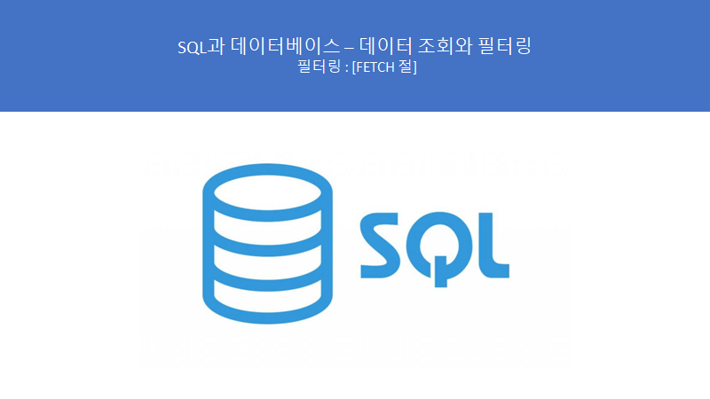
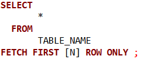
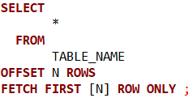
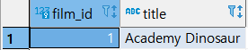
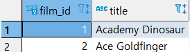
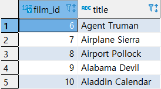

# SQL과 데이터베이스 - 데이터 조회와 필터링 : FETCH 절

> 이 학습은 패스트캠퍼스의 **올인원 패키지 : 모두를 위한 SQL/DB** 강의를 듣고 복습하는 내용입니다.



**## 정보!**

**- LIMIT절과 같은 용도  => 즉, 이런 기능은 매우 중요하다!!**

**- 1건만 추출하는 경우가 많다. => 예) 이메일에서의 선입선출로 1건만 추출**

****


## FETCH 절 문법

**특정 집합을 추력 시 출력하는 행의 수를 한정하는 역할을 한다. 부분 범위 처리시 사용된다.**


#### ● FETCH



\>> 출력하는 행의 수를 지정한다. N을 입력하지 않고 ROW ONLY만 입력하면 단 한 건만 출력한다.


#### ● FETCH, OFFSET



\>> FETCH로 출력하는 행의 수를 지정하면서 OFFSET으로 시작위치를 지정한다.

​      *OFFSET*  M값의 시작위치는 0이다. (즉 M이 3이라면 0,1,2,3 즉 4번째 행부터 시작하는 것)


## FETCH 절 실습


#### ● 기본 실습


\- 쿼리문

```SQL
SELECT
      FILM_ID
	, TITLE
 FROM
	  FILM
ORDER BY TITLE 
FETCH FIRST ROW ONLY 
;
```


\- 실행 결과



\>> TITLE로 정렬한 집합 중에서 최초의 단 한 건의 행을 리턴

\>> 만약, FIRST 1 을 쓴다고 해도 위와 같은 값이 리턴된다. 


#### ● FETCH FRIST 뒤 숫자 표시


\- 쿼리문

```SQL
SELECT
       FILM_ID
     , TITLE
  FROM
       FILM
ORDER BY TITLE 
FETCH FIRST 2 ROW ONLY
;
```


\- 실행결과



\>> *FETCH FIRST 2 ROW ONLY* 로 2개의 행을 리턴


#### ● OFFSET + FETCH


\- 쿼리문

``` SQL
SELECT
              FILM_ID
            , TITLE
  FROM
              FILM
ORDER BY TITLE 
     OFFSET 5 ROWS
FETCH FIRST 5 ROW ONLY
;
```


\- 실행 결과



\>> OFFSET은 0부터 시작이기 때문에 0 1 2 3 4 5 => 즉, 6번째 행부터 리턴

\>> *FETCH FIRST 5 ROW ONLY* 를 이용해서 5건의 행을 리턴


\## LIMIT 절을 사용할지, FETCH 절을 사용할지는 개인의 선호대로 고르면 된다.

​      하지만 보통 FETCH는 ORACLE에서 지원하는 문법