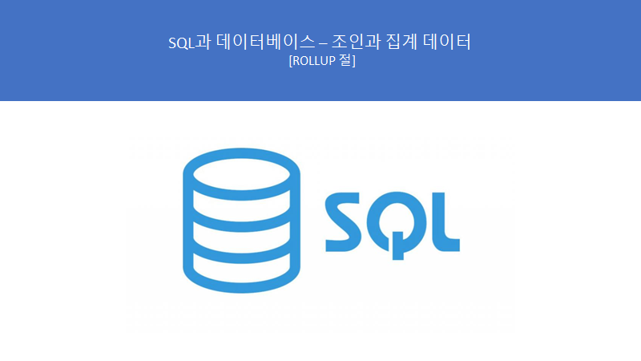
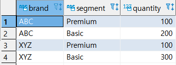
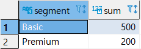
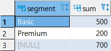
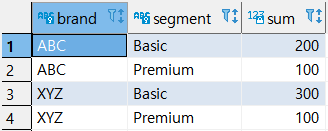
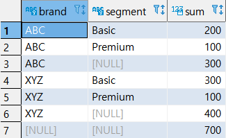
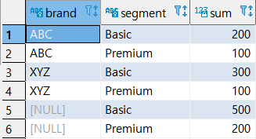
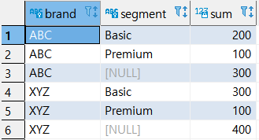

# SQL과 데이터베이스 - 조인과 집계 데이터 : ROLLUP 절


> 이 학습은 패스트캠퍼스의 **올인원 패키지 : 모두를 위한 SQL/DB** 강의를 듣고 복습하는 내용입니다.




## ROLLUP 절 설명 및 특징

- 지정된 GROUPING 컬럼의 소계를 생성하는데 사용된다.
- 간단한 문법으로 다양한 소계를 출력할 수 있다. 매우 간편해서 자주 쓰이는 문법이다.


## ROLLUP 절 실습 준비 - 테이블 생성

```sql
-- 테이블 생성 및 값 INSERT
CREATE TABLE SALES 
(
BRAND VARCHAR NOT NULL,
SEGMENT VARCHAR NOT NULL,
QUANTITY INT NOT NULL,
PRIMARY KEY (BRAND, SEGMENT)
);

INSERT INTO SALES (BRAND, SEGMENT, QUANTITY)
VALUES
  ('ABC', 'Premium', 100)
, ('ABC', 'Basic', 200)
, ('XYZ', 'Premium', 100)
, ('XYZ', 'Basic', 300);

COMMIT;

SELECT * FROM sales; 
```




## 실습 1 - 한 컬럼 ROLLUP

- GROUP BY 절

```sql
SELECT
	  SEGMENT,
	  SUM(QUANTITY)
  FROM
	  SALES
GROUP BY SEGMENT;
```




- ROLLUP 절

```sql
SELECT
	  SEGMENT,
	  SUM(QUANTITY)
  FROM
	  SALES
GROUP BY
	ROLLUP (SEGMENT)
ORDER BY SEGMENT;

-- 전체 합계가 추가 되었다.
```




## 실습 2 - 두 컬럼 ROLLUP

- GROUP BY

```sql
SELECT
	  BRAND,
	  SEGMENT,
	  SUM(QUANTITY)
  FROM
	  SALES
GROUP BY (BRAND,SEGMENT)
ORDER BY BRAND, SEGMENT;
```



- ROLLUP

```sql
SELECT
	  BRAND,
	  SEGMENT,
	  SUM(QUANTITY)
  FROM
	  SALES
GROUP BY
	ROLLUP (BRAND,SEGMENT)	-- BRAND,SEGMENT 컬럼 기준으로 ROLLPUP 한다.
ORDER BY BRAND, SEGMENT;

-- GROUP BY 별 합계 + ROLLUP절의 맨 앞에 쓴 컬럼 기준의 합계 + 전체 합계
	-- BRAND, SEGMENT 컬림 기준으로 합계를 구한다.
	-- BRAND, SEGMENT 컬럼 기준으로 합계를 구한다.
	-- BRAND 컬럼 기준으로 합계를 구한다.
	-- BRAND,SEGMENT 컬럼 기준으로 합계를 구한다.
	-- BRAND,SEGMENT 컬럼 기준으로 합계를 구한다.
	-- BRAND 컬럼 기준으로 합계를 구한다.
	-- 전체 합계를 구한다.
```




## 실습 3 - 부분 ROLLUP

```sql
SELECT
	  BRAND,
	  SEGMENT,
	  SUM(QUANTITY)
  FROM
	  SALES
GROUP BY SEGMENT,	-- SEGMENT 기준으로 GORUP BY 한다.
	ROLLUP (BRAND)	-- BRAND컬럼 기준으로 ROLLPUP 한다.
ORDER BY BRAND, SEGMENT;

-- 부분 ROLLUP = GROUP BY 별 합계 + 맨앞에 쓴 컬럼별 합계
	-- BRAND, SEGMENT 컬림 기준으로 합계를 구한다.
	-- BRAND, SEGEMTN 컬럼 기준으로 합계를 구한다.
	-- BRAND,SEGMENT 컬럼 기준으로 합계를 구한다.
	-- BRAND,SEGMENT 컬럼 기준으로 합계를 구한다.
    -- SEGMNET 컬럼 기준으로 합계를 구한다.
    -- SEGMNET 컬럼 기준으로 합계를 구한다.
	-- 부분 ROLLUP시 전체 합계는 구하지 않는다.!!!!
```




## 실습4 - 실습1에서 전체 합계만 나오지 않는 쿼리

```sql
SELECT
	  BRAND,
	  SEGMENT,
	  SUM(QUANTITY)
  FROM
	  SALES
GROUP BY BRAND,	-- BRAND 기준으로 GORUP BY 한다.
	ROLLUP (SEGMENT)	-- SEGMENT컬럼 기준으로 ROLLPUP 한다.
ORDER BY BRAND, SEGMENT;

-- 부분 ROLLUP = GROUP BY 별 합계 + 맨앞에 쓴 컬럼별 합계
	-- BRAND, SEGMENT 컬림 기준으로 합계를 구한다.
	-- BRAND, SEGEMTN 컬럼 기준으로 합계를 구한다.
	-- BRAND 컬럼 기준으로 합계를 구한다.
	-- BRAND,SEGMENT 컬럼 기준으로 합계를 구한다.
	-- BRAND,SEGMENT 컬럼 기준으로 합계를 구한다.
	-- BRAND 컬럼 기준으로 합계를 구한다.
	-- 부분 ROLLUP시 전체 합계는 구하지 않는다.!!!!
```



