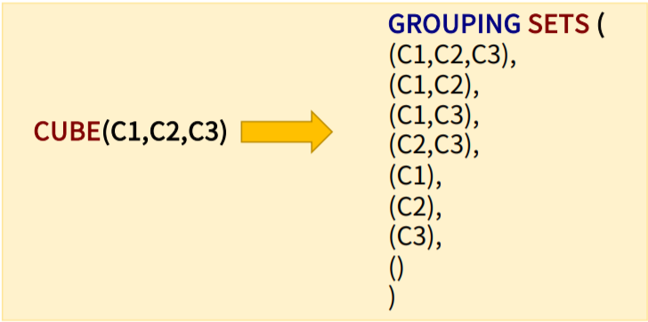
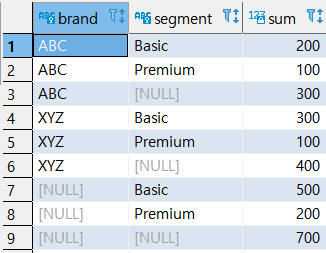
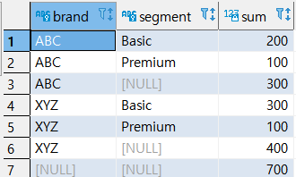
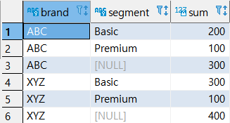

# SQL과 데이터베이스 - 조인과 집계 데이터 : CUBE 절


> 이 학습은 패스트캠퍼스의 **올인원 패키지 : 모두를 위한 SQL/DB** 강의를 듣고 복습하는 내용입니다.


## CUBE 절 설명 및 특징

- 지정된 GROUPING 컬럼의 다차원 소계를 생성하는데 사용된다.
- 간단한 문법으로 다차원 소계를 출력할 수 있다.


## CUBE 절 실습 준비 - SALES 테이블 활용

```sql
-- 테이블 생성 및 값 INSERT
CREATE TABLE SALES 
(
BRAND VARCHAR NOT NULL,
SEGMENT VARCHAR NOT NULL,
QUANTITY INT NOT NULL,
PRIMARY KEY (BRAND, SEGMENT)
);

INSERT INTO SALES (BRAND, SEGMENT, QUANTITY)
VALUES
  ('ABC', 'Premium', 100)
, ('ABC', 'Basic', 200)
, ('XYZ', 'Premium', 100)
, ('XYZ', 'Basic', 300);

COMMIT;

SELECT * FROM sales; 
```


## CUBE 절 문법

```sql
-- 전체 CUBE
SELECT
	  C1,
	  C2,
	  C3,
	  집계함수(C4)
FROM
	  TABLE_NAME
GROUP BY
	CUBE (C1,C2,C3);	-- CUBE 절에서 다차원 소계를 할 열을 지정한다.(지정한 그룹의 모든 경우에 수에 대한 소계와 총계를 구한다.)
						-- 2^3 = 8개의 소계가 발생한다.

-- 부분 CUBE
SELECT
	  C1,
	  C2,
	  C3,
	  집계함수(C4)
FROM
	  TABLE_NAME
GROUP BY C1
	CUBE (C2,C3);	-- 특정 컬럼만 분리하여 CUBE 지정을 할 수 있다.
					-- 2^2 = 4개의 소계가 발생한다. 
```



=> CUBE(C1, C2, C3)을 GROUPING SETS로 표현하면 총 8개의 소계가 발생한다.


## 실습 1 - 전체 CUBE

- CUBE 절

```sql
SELECT
	  BRAND,
	  SEGMENT,
	  SUM(QUANTITY)
FROM
	SALES
GROUP BY
	CUBE (BRAND, SEGMENT)
ORDER BY BRAND, SEGMENT;


-- 인자가 2개 이므로 총 4개의 경우의 수가 합계로 출력되었다.
-- GROUP BY 절 합계 + BRAND 별 + SEGMENT 별 + 전체합계
	-- BRAND, SEGMENT 컬럼 기준으로 합계를 구한다.
	-- BRAND, SEGMENT 컬럼 기준으로 합계를 구한다.
	-- BRAND 컬럼 기준으로 합계를 구한다.
	-- BRAND, SEGMENT 컬럼 기준으로 합계를 구한다.
	-- BRAND, SEGMENT 컬럼 기준으로 합계를 구한다.
	-- BRAND 컬럼 기준으로 합계를 구한다.
	-- SEGMENT 컬럼 기준으로 합계를 구한다.
	-- SEGMENT 컬럼 기준으로 합계를 구한다.
	-- 전체 합계를 구한다.
```




- ROLLUP 절

```sql
SELECT
	  BRAND,
	  SEGMENT,
	  SUM(QUANTITY)
FROM
	SALES
GROUP BY
	ROLLUP (BRAND, SEGMENT)
ORDER BY BRAND, SEGMENT;

-- ROLLUP은 BRAND컬럼 기준 합계만 추가되었음.
```




## 실습 2 - 부분 CUBE

```sql
SELECT
	  BRAND,
	  SEGMENT,
	  SUM(QUANTITY)
FROM
	SALES
GROUP BY BRAND,
	CUBE (SEGMENT)
ORDER BY BRAND, SEGMENT;


-- 부분 CUBE = GROUP BY 별 합계 + 맨 앞에 쓴 컬럼별 합계, 뒤에 쓴 컬럼이랑 전체 합계를 구하지 않는다!
	-- BRAND, SEGMENT 컬럼 기준으로 합계를 구한다.
	-- BRAND, SEGMENT 컬럼 기준으로 합계를 구한다.
	-- BRAND 컬럼 기준으로 합계를 구한다.
	-- BRAND, SEGMENT 컬럼 기준으로 합계를 구한다.
	-- BRAND, SEGMENT 컬럼 기준으로 합계를 구한다.
	-- BRAND 컬럼 기준으로 합계를 구한다.
	-- SEGMENT 컬럼 기준으로 소계하지 않는다.
	-- 전체 테이블 기준으로 소계하지 않는다.
```



