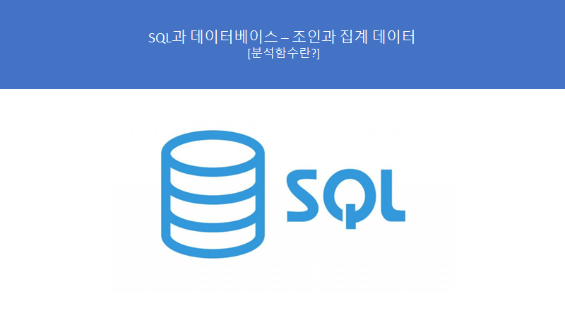
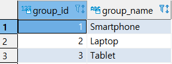
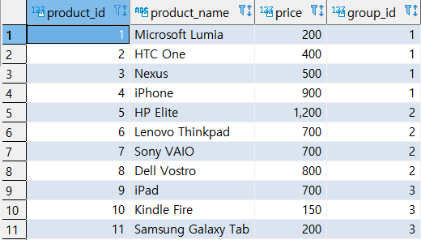
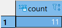
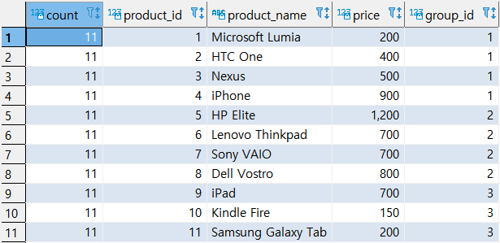

# SQL과 데이터베이스 - 분석함수


> 이 학습은 패스트캠퍼스의 **올인원 패키지 : 모두를 위한 SQL/DB** 강의를 듣고 복습하는 내용입니다.



## 분석함수 설명 및 특징

- 특정 집합 내에서 결과 건수의 변화 없이 해당 집합안에서 합계 및 카운트 등을 계산할 수 있는 함수
- 다양한 분석함수가 있다.


## 분석함수 실습 준비 (테이블 생성)

```sql
-- 실습준비 (PRODUCT_GROUP, PRODUCT 테이블 생성)
CREATE TABLE PRODUCT_GROUP (
 GROUP_ID SERIAL PRIMARY KEY,
 GROUP_NAME VARCHAR (255) NOT NULL
);
 
CREATE TABLE PRODUCT (
  PRODUCT_ID SERIAL PRIMARY KEY
, PRODUCT_NAME VARCHAR (255) NOT NULL
, PRICE DECIMAL (11, 2)
, GROUP_ID INT NOT NULL
, FOREIGN KEY (GROUP_ID) 
  REFERENCES PRODUCT_GROUP (GROUP_ID)
);

INSERT INTO PRODUCT_GROUP (GROUP_NAME)
VALUES
  ('Smartphone')
, ('Laptop')
, ('Tablet');

COMMIT; 


 
INSERT INTO PRODUCT (PRODUCT_NAME, GROUP_ID,PRICE)
VALUES
  ('Microsoft Lumia', 1, 200)
, ('HTC One', 1, 400)
, ('Nexus', 1, 500)
, ('iPhone', 1, 900)
, ('HP Elite', 2, 1200)
, ('Lenovo Thinkpad', 2, 700)
, ('Sony VAIO', 2, 700)
, ('Dell Vostro', 2, 800)
, ('iPad', 3, 700)
, ('Kindle Fire', 3, 150)
, ('Samsung Galaxy Tab', 3, 200);

COMMIT;

SELECT * FROM PRODUCT_GROUP;
SELECT * FROM PRODUCT; 
```






## 분석 함수 예시 - 집계함수와의 차이

```sql
-- 집계 함수
SELECT
	  COUNT(*)
  FROM
	  PRODUCT;
	  
-- 집계 함수는 집계의 결과만을 출력한다.
```




```sql
-- 분석 함수
SELECT
	  COUNT(*) OVER(), A.*
  FROM
	  PRODUCT A;
	  
-- 분석 함수를 통해 집계의 결과 + 테이블 내용을 함께 출력할 수 있다.
-- 카운트별 over() => 분석 함수
-- A.* => A에 있는 모든 걸 뽑아라
	 

```



