* toc
{:toc .large-only}


> - 기획배경 : Comento SQL 직무부트캠프
> - 주관 : comento
> - 개인 프로젝트


## 01. 데이터 탐색

#### 01-2. 고객 별 매출액

```sql
SELECT company,
       sum(quantity*unit_price) AS total_order_cost
FROM order_details od
LEFT JOIN products p ON od.product_id = p.id
LEFT JOIN orders o ON od.order_id = o.id
LEFT JOIN customers c ON o.customer_id = c.id
GROUP BY company
ORDER BY total_order_cost DESC;
```


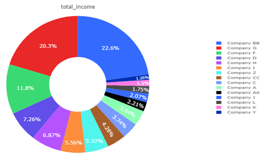

- 현재까지 매출액이 있는 고객의 수는 15개의 company이다.

- Company BB 가 전체 소득액의 22.6%를 차지한다.

- Company G가 전체 소득액의 20.3%를 차지한다.

- 위 두 고객이 전체 매출의 42.9%를 차지한다.


#### 01-2. 상품 별 판매량

```sql
SELECT product_name,
       sum(quantity) AS total_quantity
FROM order_details od
LEFT JOIN products p ON od.product_id = p.id
LEFT JOIN orders o ON od.order_id = o.id
LEFT JOIN customers c ON o.customer_id = c.id
GROUP BY product_name
ORDER BY total_quantity desc;
```


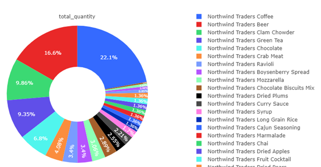

- Coffee 가 전체 판매량의 22.1%
- Beer 가 전체 판매량의 16.6%
- Clam Chowder 가 전체 판매량의 9.86%
- Green Tea 가 전체 판매량의 9.35%
- Chocolate 가 전체 판매량의 6.8%
- 위 5 가지 제품이 전체 판매량의 약 64.71%를 차지하고 있다.
- 판매량으로 보았을 때, Coffee와 Beer가 주력 상품이다.


#### 01-3. 상품 별 소득액

```sql
SELECT product_name,
       sum(quantity*unit_price) AS total_income,
FROM order_details od
LEFT JOIN products p ON od.product_id = p.id
LEFT JOIN orders o ON od.order_id = o.id
LEFT JOIN customers c ON o.customer_id = c.id
GROUP BY product_name
ORDER BY total_income desc;
```


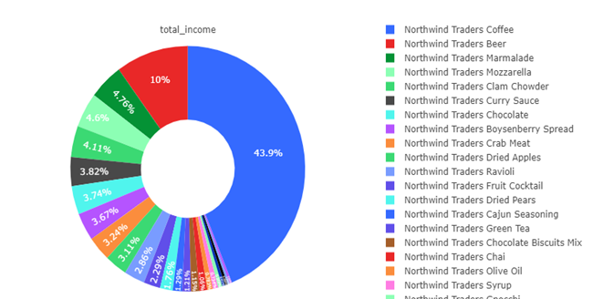


- Coffee 가 전체 소득액의 43.9%
- Beer 가 전체 소득액의 10%
- Marmalade가 전체 소득액의 4.76%
- Mozzarella가 전체 소득액의 4.6%
- Curry Sause가 전체 소득액의 4.11%
- 위 5 가지 제품이 전체 소득액의 약 67.37%를 차지하고 있다.
- 소득액으로 보았을 때 Coffee와 Beer가 주력 상품이다.


#### 01-4. 상품 별 고객 수

```sql
SELECT product_name,count(distinct company) as num_of_company
FROM order_details od
LEFT JOIN products p ON od.product_id = p.id
LEFT JOIN orders o ON od.order_id = o.id
LEFT JOIN customers c ON o.customer_id = c.id
group by product_name
order by num_of_company desc;
```


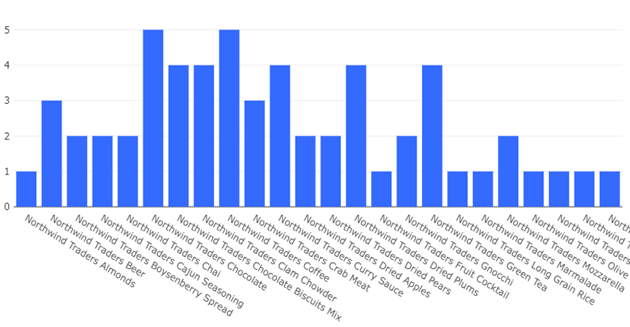

- 고객 수가 5인 상품은 Coffee, Chocolate 이다.
- 고객 수 가 4인 상품은 Curry Sauce, Chocolate Biscuits Mix, Clam Chowder, Dried Plums, Green Tea 이다.
- 각 상품 별 최대 고객 수는 5이다.


#### 01-5. 카테고리 별 상품

```sql
select category, count(product_name)
from products
group by category;
```


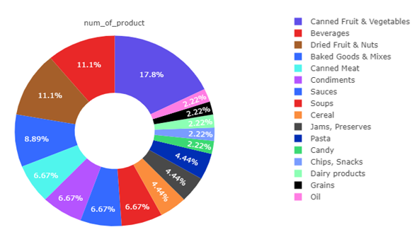

- 총 카테고리 수는 16가지, 총 상품 수는 45가지 이며,
- 각 카테고리 별 상품 수는 Canned Fruit & Vegetables(17.8%) > Beverages(11.1%) = Dried Fruit & Nuts(11.1%) 순이다.


#### 01-6. 카테고리 별 판매량

```sql
SELECT category,
       sum(quantity) AS total_quantity
FROM order_details od
LEFT JOIN products p ON od.product_id = p.id
LEFT JOIN orders o ON od.order_id = o.id
LEFT JOIN customers c ON o.customer_id = c.id
GROUP BY category
ORDER BY sum(quantity) AS total_quantity;
```


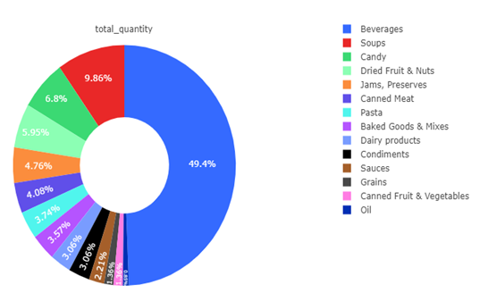

- Beverages가 전체 판매량의 49.4%
- Soups가 전체 판매량의 9.86%
- 위 2 가지 제품이 전체 판매량의 약 59.26%를 차지하고 있다.
- 판매량으로 보았을 때 주력 카테고리는 Beverages이다.


#### 01-7. 카테고리 별 고객 수

```sql
SELECT category,count(distinct company) as num_of_company
FROM order_details od
LEFT JOIN products p ON od.product_id = p.id
LEFT JOIN orders o ON od.order_id = o.id
LEFT JOIN customers c ON o.customer_id = c.id
group by category
order by num_of_company desc;
```


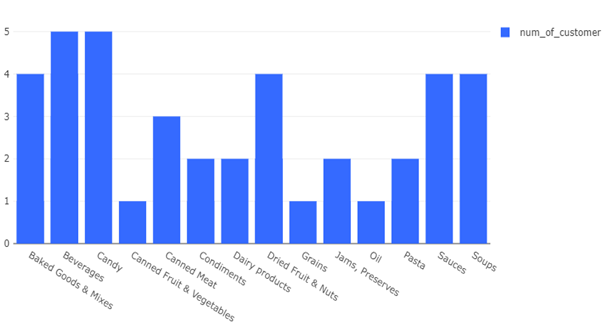

- 고객 수가 5인 카테고리는 Beverages, Candy
- 고객 수가 4인 카테고리는 Baked Goods & Mixes, Dried Fruit & Nuts, Sauces, Soups 이다.
- 각 카테고리의 최대 고객 수는 5이다.


#### 01-8. 카테고리 별 소득액

```sql
SELECT category,sum(quantity*unit_price) AS total_income
FROM order_details od
LEFT JOIN products p ON od.product_id = p.id
LEFT JOIN orders o ON od.order_id = o.id
LEFT JOIN customers c ON o.customer_id = c.id
group by category
order by total_income desc;
```


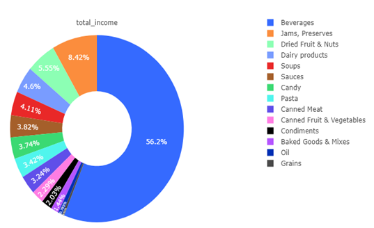

- Baverages가 전체 소득액의 56.2%
- Jams, Preserves가 전체 소득액의 8.42%
- 위 2 가지 제품이 전체 소득액의 약 64.62%를 차지하고 있다.
- 소득액으로 보았을 때, 주력 카테고리는 Beverages 이며, Coffee와 Beer의 인기 덕분으로 보인다.
- Jams, Preserves가 2번째로 높은 소득액을 보이는 이유는 Marmalade 상품의 인기 덕분으로 보인다.


#### 01-9. 월별 매출액

```sql
select date_format(order_date, '%Y-%m') ym, sum(quantity*unit_price) AS total_order_cost
FROM order_details od
LEFT JOIN orders o ON od.order_id = o.id
LEFT JOIN products p ON od.product_id = p.id
LEFT JOIN customers c ON o.customer_id = c.id
group by ym
order by ym;
```


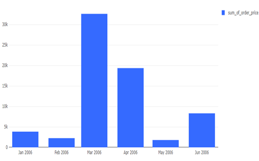

- 1,2월달에는 매출이 저조했다.
- 3,4월달에 매출이 특히 높아졌다.
- 5월달에 최저 매출을 기록했다.
- 6월달에는 5월달에 비해 매출이 반등하였다.


---


## 02. 가설 수립

#### 02-1. 가설1

매출이 있는 고객의 수는 15인데 상품 별 고객 수 & 카테고리별 고객 수는 최대 5이고, 주력 카테고리와 상품이 명확하다.

**"매출이 많은 고객(VIP)들의 주요 구매 카테고리와 상품은 비슷할 것이다."**


- 지표1 : 고객 별 매출액

  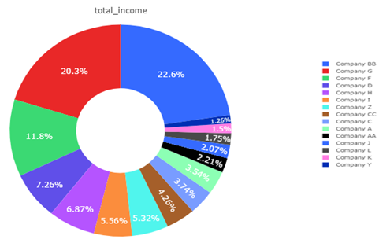

  

  - 위 데이터 탐색에서 살펴보았던 지표이다.
  - Company BB 가 전체 매출액의 22.6%를 차지한다.
  - Company G가 전체 매출액의 20.3%를 차지한다.
  - Company F가 전체 매출액의 11.8%를 차지한다.
  - 위 세 고객이 전체 매출의 54.7%를 차지한다.


- 지표2 : 회사 별 각 카테고리가 차지하는 매출의 비율

  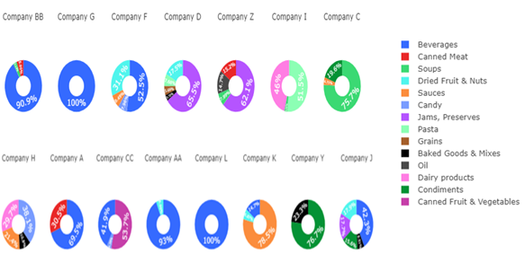

  

  - Company BB의 카테고리 별 매출액은 Beverages가 90.9%을 차지한다.
  - Company G의 카테고리 별 매출액은 Beverages가 100%를 차지한다.
  - Company F의 카테고리 별 매출액은 Beverages가 52.5%를 차지한다.


- 지표3 : 회사 별 각 상품이 차지하는 매출의 비율

  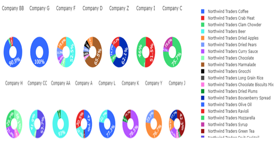

  

  - Company BB의 상품 별 매출액은 Coffee가 90.9%을 차지한다.
  - Company G의 상품 별 매출액은 Coffee가 100%를 차지한다.
  - Company F의 상품 별 매출액은 Beer가 52.5%를 차지한다.


##### 가설 1 분석 결과

- 확실한 VIP 고객의 존재
  - 15개의 고객 company 중 3개 **company(BB,** **G,** **F)**의 매출이 54.7%를 차지함으로 확실한 VIP 고객이라고 볼 수 있다
- VIP 고객의 주 구매 카테고리와 상품
  - VIP 고객들의 주 구매 카테고리는 **Beverages** 이다.
  - Top2 고객들의 주 구매 상품은 **Coffee**이다.
  - Top3 고객의 주 구매 상품은 **Beer** 이다.
  - 위 Coffee와 Beer는 northwind 회사의 판매량과 소득액 1,2위에 위치하는 상품이다.
- 프로모션 방향
  - 확실한 VIP 고객들과 확실한 주력 상품들이 존재함으로, 이에 알맞은 프로모션이 필요하다.
  - **Coffe** 상품과 **beer** **상품**에 대한 고객을 잃으면 northwind 회사의 소득의 반을 잃는 것!


#### 02-2. 가설2

가설1 분석 결과에서 보았듯이 Coffe와 Beer 상품이 매출의 대부분을 차지하고, 너무나도 확실한 VIP 고객이 존재한다.

따라서, 특정 시점에 특정 고객(VIP)의 매출이 급격하게 늘어났을 가능성이 있다. 

**"특정 고객(VIP)의 매출이 특정 시점에 급격히 중가했을 것이다. "**


- 지표1 : 월별 매출액

  

  

  - 3월달에 최고 매출을 기록했고, 5월달에 최저 매출을 기록했다.
  - 다른 달에 비해 3월달에 특히 매출이 늘었고, 그 이후 다시 감소했음으로 3월달 앞뒤에 어떤 변화가 있는지 살펴보는 것이 중요하다. 


- 지표2 : 월별 각 상품이 차지하는 매출의 비율

  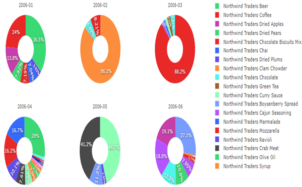

  

  - 2월달에는 Clam Chowder 상품이 86.1% 의 매출을 차지했다.
  - 3월달에는 Coffee 상품이 88.2% 의 매출을 차지했다.
  - 4월달에는 Beer 상품 28%, Coffee 상품이 16.7% 의 매출을 차지했다.
  - 3월 매출이 유독 높은 이유는 3월달에는 Coffee 상품의 영향이 크다.
  - 4월 매출은 Coffee,beer 상품의 영향으로 매출액이 높다.
  -  5월달에는 Coffee와 Beer 매출이 거의 사라졌기에 매출이 급격하게 줄어들었다.


- 지표 3 : 월&고객 별 매출액

  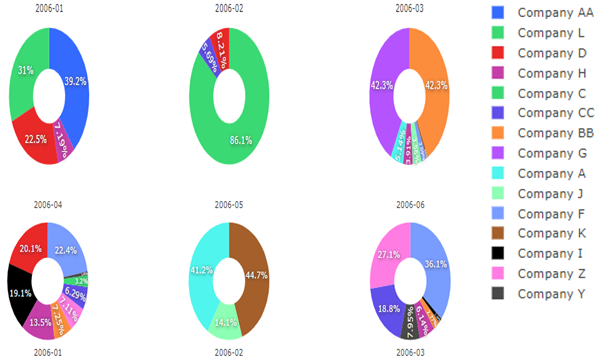

  

  - 2월달에는 Company L가 86.1%의 매출을 차지했다.
  - 3월달에는 Company BB 42.3%, Company G 42.3% 의 매출을 차지했다.
  - 4월달에는 Company F 22.4%, Company D 20.1% 의 매출을 차지했다.
  - Company BB와 Company G는 3월달에 매출의 대부분을 차지하고 그 다음달부터 주요고객에서 벗어났다.
  - Company CC와 Company D는 4월달에 매출의 대부분을 차지하고,그 다음달부터 주요고객에서 벗어났다. 


##### 가설2 분석 결과

- 주력 상품의 매출 감소

  - Coffee 와 Beer 상품의 매출의 영향으로 3,4월달에 매출액이 급격하게 상승했으나, 5월부터 그 두 상품의 매출이 급격하게 감소하였다.
- 고객의 빠른 이탈

  - 매출이 높은 달 3, 4월의 주 고객들이 빠르게 이탈하였다.
  - 3월에 company BB가 coffee 상품의 매출을 급격하게 증가시킨 후 이탈하였다.
  - 4월에 company F가 Beer 상품의 매출을 급격하게 증가시킨 후 이탈하였다.


---


## 03. 인사이트


- 자칫하면 northwind 회사의 특별한 주력상품이 존재하는 것으로 보이나, 특정 시점의 특정 회사에서의 특정 상품에 대한 구매에 의해 이뤄진 비즈니스라는 사실이 판별되었다.
  - 그 상품을 대량 구매했던 고객들은 빠르게 이탈하였다. 따라서, 그 고객이 다른 경쟁사의 물품을 구매했을 가능성을 살펴보고, 자사 상품의 문제점을 분석하여 다시 그 고객의 마음을 돌리는 방향으로 문제점을 분석할 필요가 있다.

- 위와같이 northwind의 제품과 고객의 매출을 살펴보았을 때, 꾸준히 팔리는 주력 제품이나, 단골고객이 존재하지 않는 것으로 보인다. 따라서, 주력제품을 확실하게 정하여 단골고객을 사로잡을 수 있는 방향으로 마케팅을 기획해야 할 필요성이 보인다.


  

  

  

  


